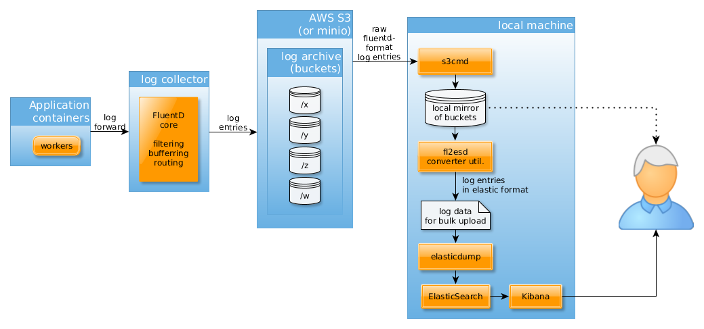

fl2esd
======

## About

This is a utility that converts [fluentd](http://www.fluentd.org/) log to [`elasticdump`](https://www.npmjs.com/package/elasticdump) format.

This simple tool can be useful, when you want to analyze log entries with 
[ElasticSearch](https://www.elastic.co/)/[Kibana](https://www.elastic.co/products/kibana) that have been collected via [fluentd](http://www.fluentd.org/),
and not directly forwarded to the ElasticSearch database, but stored in an intermediate place.

For example, a typical scenario, when the log entries are stored in Amazon S3 buckets (or [minio](https://github.com/minio)) buckets,
and later downloaded with the [`s3cmd`](http://s3tools.org/s3cmd) utility to the local drive for further analysis.
This analysis can be a direct insight into the log files and/or a deeper analysis via the analytics tools.

The following figure demonstrates this scenario:



In order to execute the whole scenario, and run all the examples, you need to install the following programs:

- [`docker-compose`](https://docs.docker.com/compose/gettingstarted/)
- [`s3cmd`](http://s3tools.org/s3cmd)
- [`elasticdump`](https://www.npmjs.com/package/elasticdump)
- [`fl2esd`](https://github.com/tombenke/fl2esd)

When you download the contents of the buckets, those are usually organized into directories, 
where each directory may contain zero or many files, and each file may contain one or more lines.

The format of the files, that hold log entries is the following:

- Each line holds one log entry.
- Each log entry is made of three elements:
    - timestamp,
    - tag,
    - the log entry in JSON format.

- The elements of the line are tab-separated.
- The line has no comma separator at the end.

Usually you can upload the content of the log files onto the ElasticSearch server,
using the [`elasticdump`](https://www.npmjs.com/package/elasticdump) utility,
however it requires a specific format, that is not the one [fluentd](http://www.fluentd.org/) produces.

Here comes `fl2esd` into picture, that makes this conversion on the selected set of log files.


## Installation

Run the install command:

```bash
    npm install -g fl2esd
```

## Usage

### Get Help

```bash
    $ fl2esd -h
    
      Usage: fl2esd [options]

      Read selected files FluentD format log entries
      and convert them to elasticdump friendly format.

      Options:

        -h, --help            output usage information
        -V, --version         output the version number
        -i, --inputs <path>   input files
        -c, --check           Do not convert, only lists the input files found by pattern
        -x, --index <_index>  The _index field of the ElasticSearch entry (default: 'fluentd')
        -t, --type <_type>    The _type field of the ElasticSearch entry (default: 'log')
```

### Select files to convert

The `--input <path>` defines the set of files, the utility should convert.
The `<path>` is a glob expression (read more about it in [the Glob Primer](https://github.com/isaacs/node-glob#glob-primer)).

In case you use the `--check` switch, the utility will list the name of the files, that match with the `<path>` expression,
and does no conversion.
This is useful, when you want to double-check which files will be converted, use this feature, in advance of the real conversion.

For example the `lib/fixtures/` directory contains some test data, that you can use for experimenting:

```bash
    $ tree lib/fixtures/
    lib/fixtures/
    ├── all.dump
    └── logs
        ├── be
        │   └── 2017031616_0.json
        └── log4r
            └── 2017032016_0.json

    3 directories, 3 file
```

Select all files:
```bash
    $ fl2esd -c -i './lib/fixtures/**/*.json'
    Reading lines from : /home/tombenke/topics/fl2esd/lib/fixtures/logs/be/2017031616_0.json
    Reading lines from : /home/tombenke/topics/fl2esd/lib/fixtures/logs/log4r/2017032016_0.json
```

or select only a subset:

```bash
    $ fl2esd -c -i './lib/fixtures/**/be/*.json'
    Reading lines from : /home/tombenke/topics/fl2esd/lib/fixtures/logs/be/2017031616_0.json
```

Note that use the single `'` or double `"` quotes when you want to use the double asterisks in the glob expression,
in order to prevent the shell to parse it.


### Convert files

This command will read all the log entry files, convert them and merge them into the `lib/fixtures/all.dump` file:

```bash
    $ fl2esd  -i './lib/fixtures/logs/**/*.json' > lib/fixtures/all.dump
```

## Upload files for analysis

For analysis, you need a running ElasticSearch instance. You can make it running on your local machine, including Kibana,
with the following `docker-compose.yml` file:

```yaml
    version: '2'
    services:
      elasticsearch:
        image: elasticsearch
        expose:
          - 9200
        ports:
          - "9200:9200"

      kibana:
        image: kibana
        links:
          - "elasticsearch"
        ports:
          - "5601:5601"
```

You only need to run it:

```bash
    docker-compose up
```

Then the previously converted log entries can be uploaded with the elasticdump utility,
if the ElasticSearch server is available:

```bash
    $ elasticdump --input=lib/fixtures/all.dump --output=http://localhost:9200/intime-ltm/ --bulk=true
    Tue, 04 Apr 2017 13:11:22 GMT | starting dump
    Tue, 04 Apr 2017 13:11:22 GMT | got 13 objects from source file (offset: 0)
    Tue, 04 Apr 2017 13:11:22 GMT | sent 13 objects to destination elasticsearch, wrote 13
    Tue, 04 Apr 2017 13:11:22 GMT | got 0 objects from source file (offset: 13)
    Tue, 04 Apr 2017 13:11:22 GMT | Total Writes: 13
    Tue, 04 Apr 2017 13:11:22 GMT | dump complete
```


## References

- [fluentd](http://www.fluentd.org/)
- [s3cmd](http://s3tools.org/s3cmd)
- [elasticdump](https://www.npmjs.com/package/elasticdump)
- [ElasticSearch](https://www.elastic.co/)
- [Kibana](https://www.elastic.co/products/kibana)
- [minio](https://github.com/minio)
- [Get started with Docker Compose](https://docs.docker.com/compose/gettingstarted/)
- [Docker Logging via EFK (Elasticsearch + Fluentd + Kibana) Stack with Docker Compose](http://docs.fluentd.org/v0.12/articles/docker-logging-efk-compose)

This project was generated by the [kickoff](https://github.com/tombenke/kickoff) utility.
